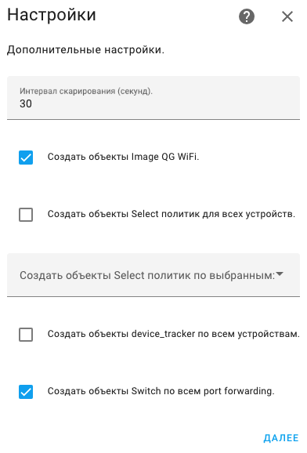

# Компонент Home Assistant для роутеров Keenetic.
Интеграция создает объекты и сервисы:  
Домен          | Объект                 | Описание
:------------- |:----------------------:| ------------:
binary_sensor  | Status                 | -
button         | Reboot                 | -
device_tracker | Device tracker client  | -
image          | QR WiFi                | -
select         | Policy client          | -
sensor         | CPU load               | -
sensor         | Memory load            | -
sensor         | Uptime                 | -
sensor         | WAN IP adress          | -
sensor         | Temperature 2.4G Chip  | -
sensor         | Temperature 5G Chip    | -
sensor         | Clients wifi           | -
switch         | Interface              | -
switch         | Port Forwarding.       | -
update         | Update router          | -
service        | Request api            | -
service        | Backup router          | -
## **Установка**
##### **HACS**
Перейдите в раздел "Интеграции" HACS, добавьте в пользовательский репозиторий malinovsku/ha-keenetic_api, затем загрузите компонент Keenetic API.
В интеграциях добавьте Keenetic API.
## **Настройка**
Помимо основных настроек при добавлении интеграции, есть еще дополнительные, где доступно включение дополнительных объектов.  
